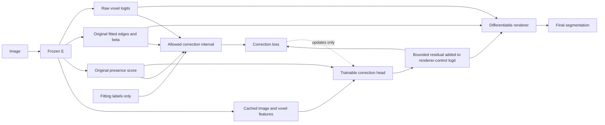

# What changes in this experiment

The original presence score still determines the original fitted geometry.
The correction is not fed back into that fit. The raw network and existing
function head are fixed; only the added residual branch is trained. It starts
with exactly zero correction, reproducing E.

Training labels define which current foreground and background predictions are
correct. For each ray, the teacher finds control values that keep those voxels
correct and overlap real foreground if currently missed. If the requirements
cannot be met simultaneously within the bounded correction range, the target
is no change. At inference, neither labels nor these target intervals are used.
The learned head must predict a useful edit from its image/voxel features.

## A synthetic example, not a measured case

One true voxel, fitted interval at that voxel, beta=1, and raw foreground
winning margin=0.4. The original control logit is -1.

| State | Added logit correction | Renderer control | True voxels retained | Added false positives |
|---|---:|---:|---:|---:|
| Original | 0 | 0.268941 | 0 | 0 |
| Minimum allowed target with numerical safety margin | 2.102954 | 0.750813 | 1 | 0 |

The teacher asks for enough correction to retain the voxel. It does not demand
a control value of one. The tested case admits residuals from 2.102954 to 4;
the small-change term favors the lower end. A background voxel with the same
activation threshold would make these preservation requirements incompatible,
and the target would be no change instead.

This shows how a feasible target can be constructed. It does not show that a
network can predict that target on new images. The matched existence-BCE arm,
inner guards and subsequent locked outer evaluation test that uncertainty.
