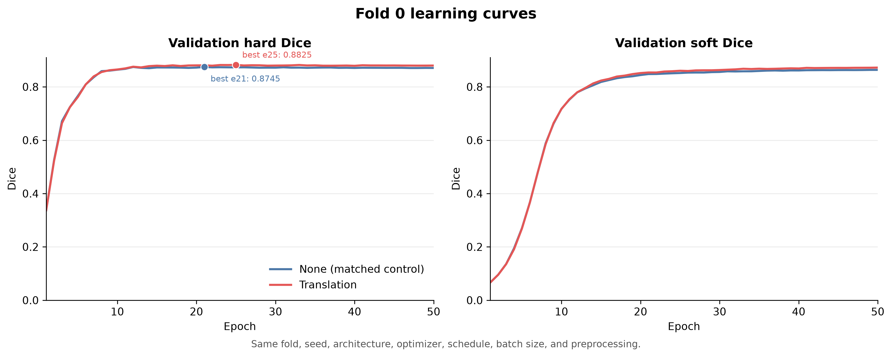
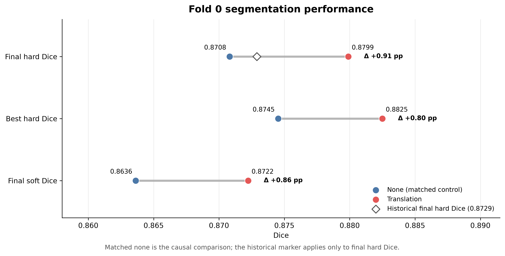
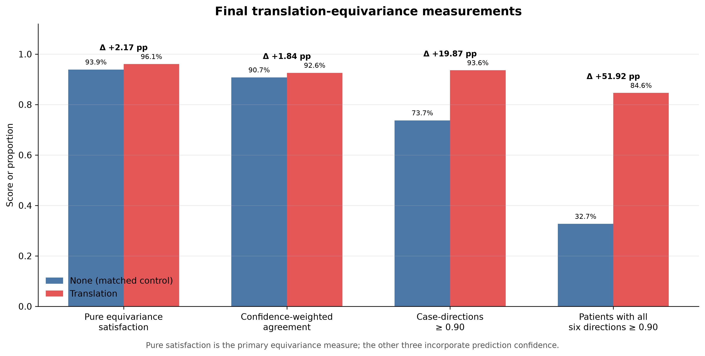
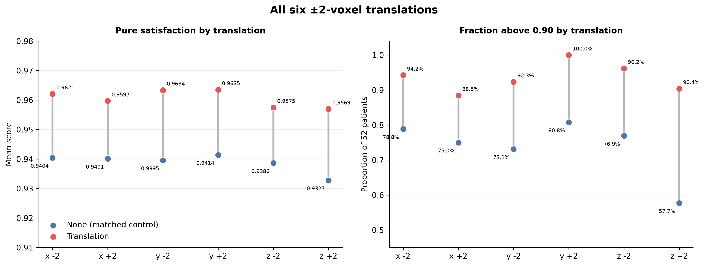
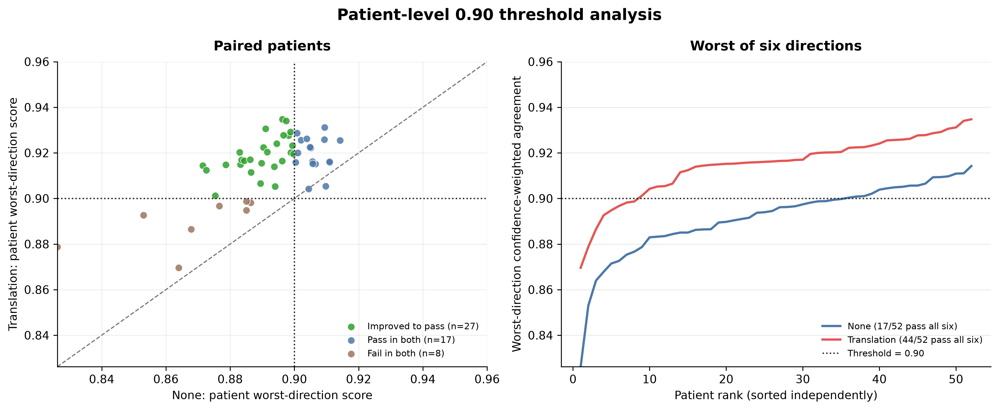

# Translation equivariance only — MSD fold 0

## Status

These are the results from the corrected translation-equivariance pipeline and its matched `constraint-set none` control. Both jobs completed successfully on the same 52-case fold-0 validation split. The trained models were subsequently evaluated for equivariance on all 130 official MSD test images.

| Arm | Slurm job | Epochs | Constraint configuration | Cluster artifact directory |
| --- | ---: | ---: | --- | --- |
| None (matched control) | `616958` | 50 | `constraint_set=none`, weight `0.0` | `/home/3160552/hippo/models/swin_unetr_new_constraints/msd_fold0_none_20260806_110334_616958` |
| Translation | `616615` | 50 | weight `0.10`, six axis-aligned shifts of `±2` voxels, one constrained sample per batch, five-epoch linear warmup | `/home/3160552/hippo/models/swin_unetr_new_constraints/msd_fold0_translation_20260805_210911_616615` |

The arms are matched on the fold-0 split (`208` training and `52` validation cases), seed (`0`), data-order generator, architecture, preprocessing, batch size (`2`), spatial size (`64³`), optimizer (AdamW, learning rate `1e-4`, weight decay `1e-5`), StepLR schedule (`step_size=20`, `gamma=0.5`), 50 epochs, and AMP disabled. The translation arm alone adds the differentiable consistency loss and its additional translated forward pass. The translation-direction RNG is separated from the data-loader RNG.

## Segmentation performance

| Metric | None | Translation | Translation − none |
| --- | ---: | ---: | ---: |
| Final hard Dice, epoch 50 | `0.87081` | **`0.87989`** | **`+0.00908`** (`+0.91` percentage points) |
| Best validation hard Dice | `0.87452` (epoch 21) | **`0.88249`** (epoch 25) | **`+0.00797`** (`+0.80` percentage points) |
| Final soft Dice, epoch 50 | `0.86362` | **`0.87223`** | **`+0.00860`** (`+0.86` percentage points) |





The historical fold-0 SwinUNETR inference result in `allenamenti.md` was hard Dice `0.8729` (training-log hard Dice `0.8737`). The corrected translation run is `+0.0070`, or `+0.70` percentage points, above that historical inference value. However, the matched `none` arm is the scientifically relevant causal comparison because it uses the same corrected runner and all other run conditions.

The final-epoch values are the conservative primary comparison. The best-epoch values are validation-selected on the same 52 cases and are descriptive, not independent test estimates.

## Equivariance measurements

For foreground class `c` and the valid overlap region after translating and restoring by shift `s`, let `p` be the original prediction and `q_s` the restored translated prediction.

The differentiable optimization satisfaction is the squared-denominator soft Dice:

$$
S_{\mathrm{pure},c}(s) =
\frac{2\sum_{x \in \Omega_s} p_c(x)q_{s,c}(x)+\epsilon}
{\sum_{x \in \Omega_s}p_c(x)^2+\sum_{x \in \Omega_s}q_{s,c}(x)^2+\epsilon}.
$$

It is averaged over the two foreground classes. Identical probability maps score exactly `1.0`, irrespective of their confidence, so this is the primary pure equivariance measurement.

The separately reported confidence-weighted agreement uses a linear denominator:

$$
S_{\mathrm{conf},c}(s) =
\frac{2\sum_{x \in \Omega_s} p_c(x)q_{s,c}(x)}
{\max\!\left(\sum_{x \in \Omega_s}p_c(x)+\sum_{x \in \Omega_s}q_{s,c}(x),\epsilon\right)}.
$$

This score is also averaged over the two foreground classes. It measures agreement and prediction confidence together; identical uncertain maps can score below `1.0`. The reporting threshold `0.90` is applied to this confidence-weighted case-direction score. It is not applied to the pure optimization satisfaction and it is not part of checkpoint selection.

| Final measurement over all six directions | None | Translation | Translation − none |
| --- | ---: | ---: | ---: |
| Pure equivariance satisfaction | `0.93880` | **`0.96051`** | **`+0.02171`** |
| Confidence-weighted agreement | `0.90747` | **`0.92583`** | **`+0.01837`** |
| Case-directions with confidence-weighted agreement ≥ `0.90` | `230/312` (`73.72%`) | **`292/312` (`93.59%`)** | **`+62/312` (`+19.87` pp)** |
| Patients passing all six directions | `17/52` (`32.69%`) | **`44/52` (`84.62%`)** | **`+27/52` (`+51.92` pp)** |

Here, `312 = 52 patients × 6 directions`. A patient passes the strict all-directions criterion only if each of its six case-direction confidence-weighted agreement values is at least `0.90`.



### Results by direction

| Shift | None pure | Translation pure | None confidence-weighted | Translation confidence-weighted | None ≥ `0.90` | Translation ≥ `0.90` |
| --- | ---: | ---: | ---: | ---: | ---: | ---: |
| `x −2` | `0.94042` | **`0.96205`** | `0.90875` | **`0.92726`** | `41/52` | **`49/52`** |
| `x +2` | `0.94011` | **`0.95967`** | `0.90841` | **`0.92474`** | `39/52` | **`46/52`** |
| `y −2` | `0.93954` | **`0.96338`** | `0.90841` | **`0.92843`** | `38/52` | **`48/52`** |
| `y +2` | `0.94138` | **`0.96349`** | `0.91029` | **`0.92923`** | `42/52` | **`52/52`** |
| `z −2` | `0.93859` | **`0.95749`** | `0.90721` | **`0.92331`** | `40/52` | **`50/52`** |
| `z +2` | `0.93275` | **`0.95695`** | `0.90174` | **`0.92204`** | `30/52` | **`47/52`** |



### Patient-level threshold behavior

All `17` patients that passed all six directions in the `none` run also passed in the translation run. A further `27` patients changed from failing to passing; no patient changed from passing to failing. Eight patients remained below the strict all-six threshold:

| Patient | Worst confidence-weighted agreement | Failing directions out of six |
| --- | ---: | ---: |
| `hippocampus_217` | `0.86959` | `5` |
| `hippocampus_280` | `0.87878` | `5` |
| `hippocampus_125` | `0.88650` | `3` |
| `hippocampus_219` | `0.89263` | `3` |
| `hippocampus_164` | `0.89481` | `1` |
| `hippocampus_350` | `0.89669` | `1` |
| `hippocampus_123` | `0.89818` | `1` |
| `hippocampus_349` | `0.89869` | `1` |



## Independent MSD test cohort — 130 images

The official MSD `imagesTs` cohort contains 130 images that are disjoint from the 260 labelled training images. No `labelsTs` ground truth is available locally. Consequently, equivariance can be evaluated on this independent cohort without labels, but hard and soft segmentation Dice cannot be calculated.

Both final-epoch models and both best-validation checkpoints were evaluated with the same image preprocessing used during training: nonzero per-case intensity normalization, spatial padding and centre cropping to `64³`, and no AMP. Every model was evaluated in all six `±2`-voxel directions. Each checkpoint therefore produced:

- `130` patients;
- `780 = 130 × 6` case-direction measurements;
- `1,560 = 130 × 6 × 2` foreground-class measurements.

### Primary test comparison — final epoch

| Test-set measurement | None | Translation | Translation − none |
| --- | ---: | ---: | ---: |
| Pure equivariance satisfaction | `0.93831` | **`0.96035`** | **`+0.02203`** |
| Confidence-weighted agreement | `0.90781` | **`0.92650`** | **`+0.01869`** |
| Mean patient worst-direction confidence-weighted agreement | `0.89288` | **`0.91420`** | **`+0.02132`** |
| Case-directions with confidence-weighted agreement ≥ `0.90` | `571/780` (`73.21%`) | **`747/780` (`95.77%`)** | **`+176/780` (`+22.56` pp)** |
| Patients passing all six directions | `44/130` (`33.85%`) | **`109/130` (`83.85%`)** | **`+65/130` (`+50.00` pp)** |

Pure satisfaction improved for all `130/130` paired patients. The patient-resampled bootstrap 95% confidence interval for the mean pure-satisfaction difference was `[+0.02090, +0.02318]` using 50,000 bootstrap replicates. Confidence-weighted agreement improved for `129/130` patients.

For the strict all-six criterion, `65` patients changed from failing under `none` to passing under `translation`, while no patient changed from passing to failing. The exact paired McNemar test gives `p = 5.42 × 10⁻²⁰`. The patient-resampled 95% confidence interval for the all-six pass-rate difference was `[+41.54, +58.46]` percentage points.

### Test results by direction — final epoch

| Shift | None pure | Translation pure | Pure difference | None ≥ `0.90` | Translation ≥ `0.90` |
| --- | ---: | ---: | ---: | ---: | ---: |
| `x −2` | `0.93821` | **`0.96117`** | `+0.02296` | `93/130` | **`129/130`** |
| `x +2` | `0.94024` | **`0.96044`** | `+0.02020` | `105/130` | **`126/130`** |
| `y −2` | `0.93866` | **`0.96307`** | `+0.02440` | `91/130` | **`125/130`** |
| `y +2` | `0.93889` | **`0.96335`** | `+0.02446` | `98/130` | **`127/130`** |
| `z −2` | `0.93822` | **`0.95646`** | `+0.01824` | `95/130` | **`119/130`** |
| `z +2` | `0.93566` | **`0.95758`** | `+0.02193` | `89/130` | **`121/130`** |

The pure score improved in every direction and for every patient. The smallest direction-level improvement was still `+0.01824` for `z −2`.

### Best-validation checkpoint sensitivity analysis

The same conclusion holds when the checkpoint selected by validation hard Dice is used for each arm:

| Test-set measurement | None best, epoch 21 | Translation best, epoch 25 | Translation − none |
| --- | ---: | ---: | ---: |
| Pure equivariance satisfaction | `0.95599` | **`0.97315`** | **`+0.01717`** |
| Confidence-weighted agreement | `0.87903` | **`0.90372`** | **`+0.02469`** |
| Case-directions ≥ `0.90` | `58/780` (`7.44%`) | **`522/780` (`66.92%`)** | **`+464/780` (`+59.49` pp)** |
| Patients passing all six directions | `0/130` | **`47/130` (`36.15%`)** | **`+47/130` (`+36.15` pp)** |

Pure satisfaction again improved for every one of the 130 patients; its paired bootstrap 95% confidence interval was `[+0.01622, +0.01814]`.

The best checkpoints have higher pure satisfaction but much lower threshold pass rates than the final checkpoints. This is not contradictory: the earlier checkpoints are less confident, and the linear-denominator score penalizes uncertainty even when two maps are equivariant. This sensitivity to training epoch is direct evidence that the `0.90` statistic must remain a secondary confidence-confounded diagnostic. It should not replace pure satisfaction as the headline constraint measurement.

### Prediction-collapse checks

There is no indication that the constraint obtained higher equivariance through trivial background collapse:

- both foreground classes were present in the hard predictions for all `130` test images under both final models;
- the mean hard foreground fraction changed only from `1.2465%` under `none` to `1.2570%` under `translation`;
- the mean soft foreground fraction changed only from `1.2647%` to `1.2751%`;
- mean confidence and normalized entropy changed only minimally.

These are useful label-free sanity checks, but they are not substitutes for segmentation Dice against ground truth.

### Validation–test agreement

| Cohort | None pure | Translation pure | None passing all six | Translation passing all six |
| --- | ---: | ---: | ---: | ---: |
| Fold-0 validation, 52 cases | `0.93880` | `0.96051` | `17/52` (`32.69%`) | `44/52` (`84.62%`) |
| Official test images, 130 cases | `0.93831` | `0.96035` | `44/130` (`33.85%`) | `109/130` (`83.85%`) |

The near-identical validation and test estimates provide strong evidence that the observed equivariance effect generalizes beyond the 52 cases used during training validation.

## Interpretation

This fold-0 experiment is promising on both intended outcomes, with independent image-only test evidence for the constraint effect:

- On the independent 130-image test cohort, the translation arm improves the primary pure equivariance score for every patient and every direction.
- The strict patient-level threshold pass count increases from `17/52` to `44/52`.
- On the independent test images, the corresponding count increases from `44/130` to `109/130`.
- Segmentation performance does not trade off against the constraint in this run; final hard Dice improves by `0.91` percentage points over the matched control.
- The confidence-weighted results support the same direction of effect, but they must not be described as pure equivariance because confidence contributes to the score.

The independent test evaluation supports a strong claim that the translation constraint improves translation equivariance for these trained models. It does not establish improved test-set segmentation performance because the official 130 test images have no locally available ground-truth labels. The `+0.91` percentage-point hard-Dice result therefore remains a fold-0 validation result.

This is still one training fold and one seed. The 52 validation cases are used for epoch-wise validation and checkpoint selection. The next confirmatory segmentation step is to repeat the matched `none`/`translation` comparison over additional seeds and preferably all folds, producing out-of-fold predictions over the 260 labelled images, or to obtain an official evaluation against the hidden test labels. The fixed final-epoch comparison should remain primary, with best-validation checkpoint results clearly labelled as selected estimates.

## Reproducibility note

The validation values in this sheet were read from each run's `config.json`, `metrics.csv`, `final_metrics.json`, and `validation_constraint_details.csv`. The plots are generated from those completed-run artifacts. Older translation results produced before the corrected metric and RNG handling are intentionally excluded from the tables above.

The independent test evaluations ran as Slurm jobs `617112` and `617114`, both with exit code `0:0`. The cluster outputs are stored under:

```text
/home/3160552/equivariance_test_eval/results_20260806/
```

Each of the four checkpoint directories contains `test_equivariance_summary.json`, `test_equivariance_details.csv`, and `test_prediction_sanity.csv`. The combined `paired_analysis.json` contains the 50,000-replicate patient-level bootstrap intervals, paired transition counts, and exact McNemar tests. Every CSV denominator, aggregate, threshold flag, patient set, finite value, and class-probability fraction was independently reconciled after completion.
